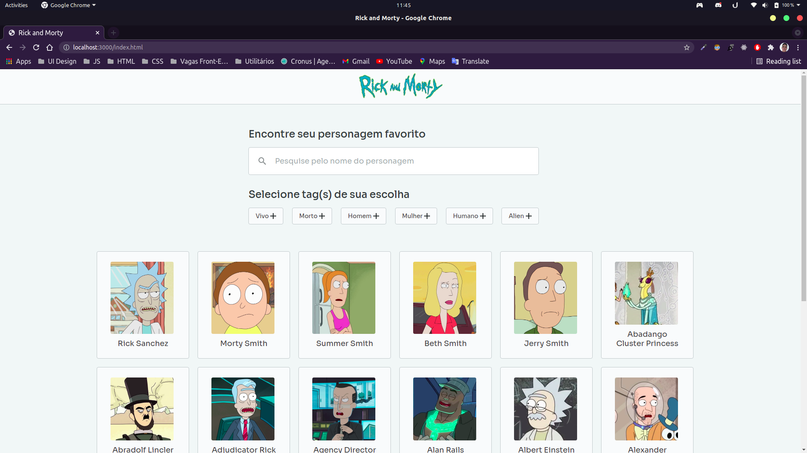

# Rick And Morty

## Utilização

### Em tempo real
- [Veja a página](https://marcosmacedoo.github.io/rick-and-morty/index.html)

### Localmente
- Faça o clone desse repositório
- Entre dentro da pasta `rick-and-morty/`
- Abra o arquivo `index.html`
